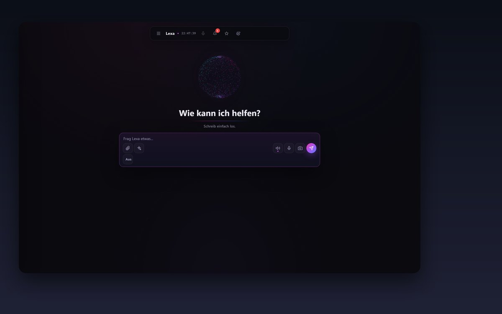

# LEXA AI v1.0.0

**Dein lokaler KI-Desktop-Assistent für Windows.**



[](https://github.com/hamid49174/lexa-ai/actions/workflows/ci.yml)
[](LICENSE)


Lexa steuert deinen PC per Sprache und Chat - lokal-first, privat und mit optionalen Cloud-Providern.

---

## Schnellstart

```bash
# 1. Repo klonen und Dependencies installieren
git clone https://github.com/hamid49174/lexa-ai.git
cd lexa-ai
python -m venv venv
venv\Scripts\pip install -r requirements.txt

# 2. Frontend installieren
cd frontend && npm install && cd ..

# 3. API-Keys hinterlegen
#    Chat läuft Gemini-only -> der Gemini-Key ist erforderlich.
venv\Scripts\python -c "import keyring; keyring.set_password('lexa-ai', 'gemini_api_key', 'DEIN_GEMINI_KEY')"
#    Optional NUR für Sprache (STT/TTS), nicht für den Chat:
venv\Scripts\python -c "import keyring; keyring.set_password('lexa-ai', 'groq_api_key', 'DEIN_GROQ_KEY')"
venv\Scripts\python -c "import keyring; keyring.set_password('lexa-ai', 'openai_api_key', 'DEIN_OPENAI_KEY')"

# 4. Starten
start.bat
```

---

## Funktionen

- **138+ PC-Befehle** - Apps, Fenster, Prozesse, Netzwerk, Dienste, Autostart, Umgebungsvariablen
- **KI-Chat** - Google Gemini (Gemini-only; frühere Multi-Provider-Gerüste sind Legacy)
- **Sprache** - Deepgram Nova-3 STT + Groq/local fallback, Cartesia/ElevenLabs/SAPI TTS
- **Browser-Automation** - YouTube, Web-Scraping, PDFs, Screenshots (Playwright)
- **Produktivität** - Todos, Pomodoro-Timer, Gewohnheiten, Zeiterfassung, Fokus-Modus
- **Datei-Tools** - Archive, Backups, PDF merge/split, Bild-Konvertierung, Duplikat-Finder
- **Developer-Tools** - Git, Docker, API-Tester, Log-Analyse, JSON/Regex/Base64-Utilities
- **Kommunikation** - E-Mail (Gmail), Telegram, Discord
- **Gedächtnis** - SQLite mit FTS5, Notizen, Routinen, Profil
- **Sicherheit** - 3-Tier Whitelist, Prompt-Injection-Defense, Rate Limiting, Audit Log
- **7 Views** - Dashboard, Chat, System, Commands, Productivity, Memory, Settings
- **Responsive UI** - Mobile-Breakpoints, ARIA Accessibility, Keyboard Shortcuts

---

## Voraussetzungen

- **Windows 10/11**
- **Python 3.11+**
- **Node.js 18+**
- **Git**

Optional: Ollama (lokale KI), ffmpeg (Media-Konvertierung)

---

## Installation

```bash
# Repository klonen
git clone https://github.com/hamid49174/lexa-ai.git
cd lexa-ai

# Python Virtual Environment
python -m venv venv
venv\Scripts\pip install -r requirements.txt

# Playwright Browser
venv\Scripts\playwright install chromium

# Frontend Dependencies
cd frontend && npm install && cd ..
```

### API-Keys der Cloud-Dienste

Der **Chat läuft Gemini-only** — der Gemini-Key ist die einzige Voraussetzung für die KI:

```bash
venv\Scripts\python -c "import keyring; keyring.set_password('lexa-ai', 'gemini_api_key', 'DEIN_GEMINI_KEY')"
```

Gemini-Key: [aistudio.google.com](https://aistudio.google.com)

Groq- und OpenAI-Keys sind **optional und nur für Sprache (STT/TTS)** relevant, nicht für den Chat (siehe Voice Setup).

Alternativ: kopiere `.env.example` nach `.env` und trage den Key dort ein.

### Sprachfunktion einrichten

Voice nutzt den Windows Credential Manager für optionale Cloud-Provider.

- **STT** - Deepgram Nova-3 (primaer), Groq Whisper (Fallback), lokales faster-whisper (offline)
- **TTS** - Cartesia Sonic (Cloud), ElevenLabs (optionale Premium-Stimmen), Windows SAPI (offline Fallback)

Beispiel für API-Keys:

```python
import keyring
keyring.set_password("lexa-ai", "deepgram_api_key", "DEIN_DEEPGRAM_KEY")
keyring.set_password("lexa-ai", "cartesia_api_key", "DEIN_CARTESIA_KEY")
keyring.set_password("lexa-ai", "elevenlabs_api_key", "DEIN_ELEVENLABS_KEY")
keyring.set_password("lexa-ai", "groq_api_key", "DEIN_GROQ_KEY")  # optionaler STT-Fallback
```

Deepgram Key: [deepgram.com](https://deepgram.com)  
Cartesia Key: [cartesia.ai](https://cartesia.ai)  
ElevenLabs Key: [elevenlabs.io](https://elevenlabs.io)

---

## Starten

**Ein-Klick-Start:**

```bash
start.bat
```

Oder manuell:

```bash
# Backend (Terminal 1)
venv\Scripts\python -m uvicorn backend.main:app --host 127.0.0.1 --port 8000

# Frontend (Terminal 2)
cd frontend && npx electron .
```

### Personal-OS-Anbindung

Lexa stellt dem lokalen Personal OS einen schmalen Endpunkt zum Extrahieren bereit:

```http
POST /personal-os/raw-inbox/extract
```

Request:

```json
{
  "sourcePath": "06_Inbox/Raw/example.txt",
  "body": "Raw inbox text"
}
```

Response:

```json
{
  "status": "ok",
  "summary": "...",
  "tags": ["inbox", "raw"],
  "provider": "gemini",
  "model": "gemini-3.5-flash"
}
```

Dieser Endpunkt ist bewusst vom normalen `/chat` getrennt: kein Chat-Verlauf, keine Tool-Ausführung, nur Zusammenfassung und Tags.

---

## Tech-Stack

| Komponente | Technologie |
|------------|-------------|
| Frontend | Electron + Vanilla JS (modular) |
| Backend | Python FastAPI (Port 8000, localhost) |
| KI (Chat) | Google Gemini (Gemini-only) |
| STT | Deepgram Nova-3 + Groq Whisper + faster-whisper |
| TTS | Cartesia Sonic + ElevenLabs + Windows SAPI |
| Browser | Playwright + yt-dlp |
| Datenbank | SQLite mit FTS5 Volltextsuche |
| Security | keyring + 3-Tier Whitelist + Rate Limiting |

---

## Build aus dem Quellcode

Lexa nutzt PyInstaller für das Backend-Bundle und `electron-builder` für den Windows-Installer:

```powershell
powershell -ExecutionPolicy Bypass -File scripts\build_installer.ps1
```

Das erzeugt zuerst `backend-dist\lexa-backend\lexa-backend.exe` und danach einen NSIS-Installer unter `dist\`.
Die Electron-Konfiguration liegt in `frontend\electron-builder.json`.
`npm run build` im Frontend prüft vor `electron-builder`, dass dieses Backend-Bundle vorhanden ist.

Einzelne Schritte:

```powershell
venv\Scripts\python.exe build_backend.py
cd frontend
npm run build
```

---

## Tests

```bash
# Optional: install local development/build tooling
venv\Scripts\pip install -r requirements-dev.txt

# Backend-Tests
venv\Scripts\python -m pytest -q

# Einzelne Test-Module
venv\Scripts\python -m pytest tests/test_memory.py -v
venv\Scripts\python -m pytest tests/test_security.py -v

# Frontend-Rendering-Checks
node tests/test_chat_rendering.js

# Python-Lint wie in CI
# Hinweis: derzeit Report-Gate bis zum Lint-Baseline-Cleanup
venv\Scripts\python -m flake8 backend companion voice --max-line-length=120 --ignore=E501,W503,E402
```

### Release-Reife

Lexa nutzt skriptgesteuerte Release-Gates statt manueller Einzelprüfungen:

```powershell
scripts\run_quality_gates.ps1 -Mode Quick
scripts\run_quality_gates.ps1 -Mode Full
scripts\run_release_candidate_check.ps1 -Target InternalRC
scripts\check_remote_ci_readiness.ps1
scripts\generate_codex_context_pack.ps1 -Check
```

Release-Stufen:

- `InternalRC`: interner Review-Kandidat, Warnungen erlaubt, wenn dokumentiert.
- `PublicRC`: braucht CI-Nachweis, Signatur, Installer-Test in einer VM, geprüftes Cleanup-Risiko und ein klares Website-Ziel.
- `PublicRelease`: PublicRC plus Release- und Datenschutz-Freigabe.

Vor Release-Arbeiten `AGENTS.md`, `docs/codex_context_pack.md` und `docs/release/release_candidate_checklist.md` lesen.

Release-Gates:

```powershell
powershell -ExecutionPolicy Bypass -File scripts\run_quality_gates.ps1 -Mode Full
powershell -ExecutionPolicy Bypass -File scripts\run_quality_gates.ps1 -Mode CI
powershell -ExecutionPolicy Bypass -File scripts\run_release_candidate_check.ps1
powershell -ExecutionPolicy Bypass -File scripts\run_release_candidate_check.ps1 -Mode StrictRC
```

Der Release-Kandidaten-Check läuft nur lokal: kein Deploy, kein Upload, keine gelöschten Dateien, keine committeten Build-Artefakte. Zusätzlich gibt es Clean-Clone-, Packaging- und Installer-Smokes:

```powershell
powershell -ExecutionPolicy Bypass -File scripts\run_clean_clone_smoke.ps1
powershell -ExecutionPolicy Bypass -File scripts\run_clean_clone_smoke.ps1 -Install -RunQuickGate -KeepTemp
powershell -ExecutionPolicy Bypass -File scripts\run_packaging_smoke.ps1 -Build
powershell -ExecutionPolicy Bypass -File scripts\run_installer_smoke.ps1 -ArtifactRoot <artifact-dir>
```

Auch der Lizenz-Check ist skriptgesteuert. `LEXA_LICENSE_SMOKE_KEY`, optional `LEXA_LICENSE_SMOKE_API_URL` und `LEXA_LICENSE_SMOKE_EXPECTED_PLAN` außerhalb von Git setzen, dann:

```powershell
powershell -ExecutionPolicy Bypass -File scripts\run_paid_license_smoke.ps1
```

`StrictRC` unterscheidet `Ready` von `Needs Review`, solange CI-Nachweis, Signatur oder der VM-Installationstest fehlen. Details in `docs/release/release_candidate_checklist.md` und den Runbooks unter `docs/release/`.

Was für einen öffentlichen Release noch fehlt (signierter Installer, VM-Installationsnachweis, Website-Ziel, Datenschutz-Checkliste), steht in `docs/release/public_rc_blocker_matrix.md` und der Release-Checkliste.

---

## Sicherheit

- **Kein externer Zugriff** - API nur auf `127.0.0.1`
- **3-Tier Whitelist** - gefährliche Befehle blockiert oder brauchen Bestaetigung
- **Prompt Injection Defense** - Pattern-Matching plus Unicode-Normalisierung
- **Path/URL/Param Validation** - System-Verzeichnisse blockiert, SSRF-Schutz
- **Rate Limiting** - pro Endpoint
- **Audit Log** - jeder Befehl wird protokolliert
- **Keine Secrets im Code** - alles über Windows Credential Manager (`keyring`)

---

## Lizenz

MIT — siehe [LICENSE](LICENSE). © 2026 Hamid ([hamid49174](https://github.com/hamid49174)).

## Credits

Gebootstrapped mit dem [ai-coding-starter-kit](https://github.com/AlexPEClub/ai-coding-starter-kit) von Alex Sprogis (MIT) — genutzt für die Claude-Code-Skills- und Workflow-Struktur (`.claude/`). Die Lexa-Anwendung selbst (Backend, Companion, Voice, Frontend) wurde eigenstaendig entwickelt.
